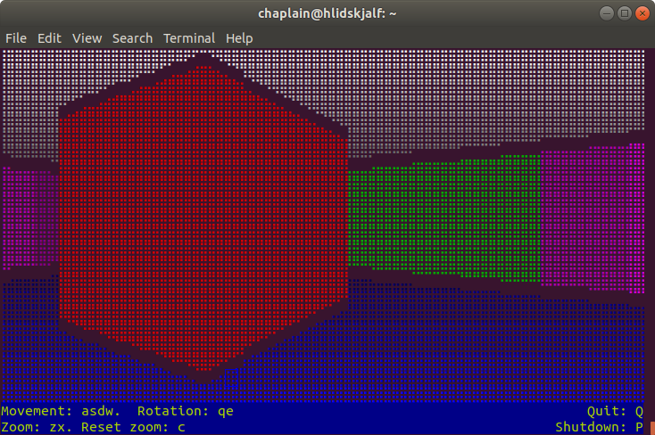

# munin-acceptance
A test-bed and example usage for various projects, including Server++, 
Telnet++, Terminal++ and Munin.

Implements a Telnet server that allows a connected client to navigate
a text-based ray-casted 3D landscape.

[]
