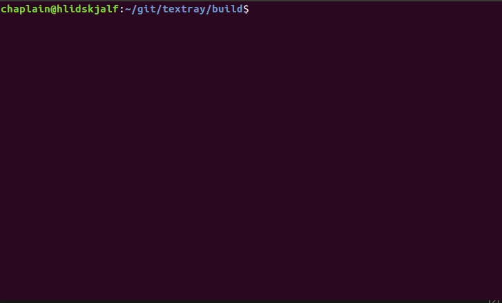

# Textray

A test-bed and example usage for various projects, including Server++, Telnet++, Terminal++ and Munin.

Implements a Telnet server that allows a connected client to navigate
a text-based ray-casted 3D landscape.



## Requirements

- C++17 compiler
- CMake 3.12+
- Boost 1.69+ (`container`, `format`, `program_options`)
- `gsl-lite`
- `fmt` 5.3+
- `nlohmann_json` 3.3.0+
- `zlib`
- `Threads`
- KazDragon libraries:
  - `serverpp` 0.2.0+
  - `telnetpp` 3.0.0+
  - `terminalpp` 3.0.0+
  - `munin` 0.7.1+
  - optional `consolepp` 0.1.1+ (only if `munin` requires it)

## Build

```bash
git clone https://github.com/KazDragon/textray.git
cd textray

cmake -S . -B build \
  -DCMAKE_BUILD_TYPE=Release \
  -DCMAKE_PREFIX_PATH="$HOME/.local"

cmake --build build --config Release --target textray
```

Textray is an application (not an installable library package), so the primary
output is the `textray` executable target.

## Dependency Resolution With vcpkg

Textray can resolve third-party dependencies through `vcpkg`:

```bash
cmake -S . -B build \
  -DCMAKE_BUILD_TYPE=Release \
  -DCMAKE_TOOLCHAIN_FILE="$VCPKG_ROOT/scripts/buildsystems/vcpkg.cmake" \
  -DCMAKE_PREFIX_PATH="$HOME/.local"
```

When using manifest mode (`vcpkg.json` in this repository), configure will
trigger third-party dependency installation automatically. KazDragon
dependencies are expected to be discoverable through `CMAKE_PREFIX_PATH`, or
provided from source by a superproject.
